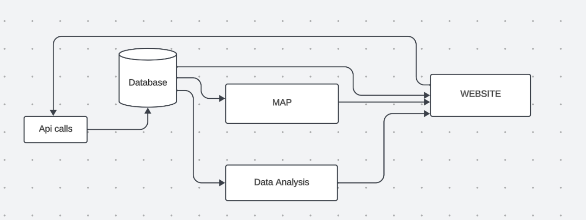
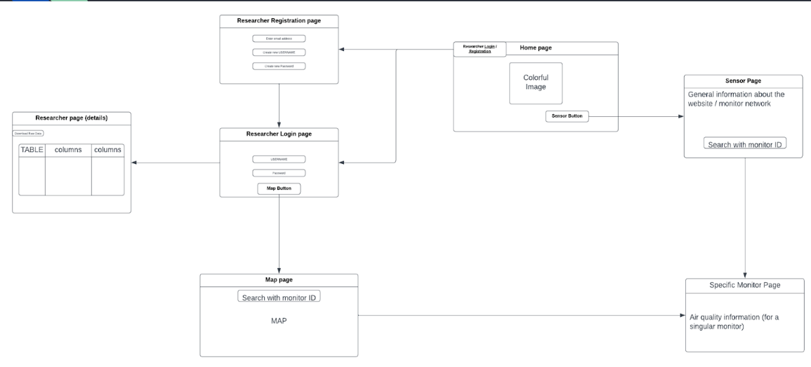
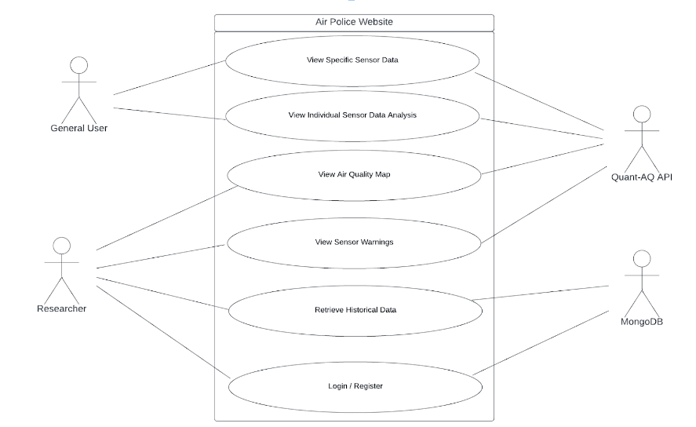

# Project Description
  Over the years, the Salton Sea in Riverside has shrunk, exposing a bed of toxic waste and pesticide-runoff to the atmosphere. As it dries, toxic dust is blown with the wind so researchers and nearby residents wish to monitor the local air quality. 

  The goal for this project is to improve ease of access of air quality information provided by sensors in the Salton Sea area. We aim to make it easier to read data from the Quant-AQ API and provide an alert system for the status of air monitors.

  Our project is important because it helps residents better understand their local air quality and find out if their air filters are effective or not. Our project also provides tools to researchers so that they are to do their jobs more efficiently.
 
  We rely on pre-existing air quality monitors installed in various residences around the Salton Sea for real-time data collection. Python serves as our primary tool to generate data visualizations such as graphs, charts and maps. Additionally, we are using Postgres SQL as our database management system.
# System Architecture

# Wire Frame

# Use Case


# Dependencies
  ```
  pip install -r requirements.txt
  ```
* Node.js - https://nodejs.org
  
# Install Python
* Please have Python version 3.8 or greater installed to compile our project. Instructions to install python are on this website: https://python.org

# Install node js
* Please have node js installed to compile our project. Instructions to install node js are on this website: https://nodejs.org

# Set up Vercel Postgres SQL
* Please set up Postgres for Vercel to ensure a working database for this website. The instructions are here: https://vercel.com/docs/storage/vercel-postgres/quickstart 


# Set up enviroment secrets (.env for your IDE or Secrets for Vercel)
* create a .env file to the main directory and add
  ```
api_key = 
HASH = 
private_key = 
key="oops"
mailtrapeuser=
mailtrappassword=  
porterUser = 

POSTGRES_URL=
POSTGRES_USER=       # this should automatically be generated for you through vercel.
POSTGRES_PASSWORD=

ContentfulID = 
ContentfulApiToken=
environmentIDs = 
environmentID =
  ```
  
# How to access our local host website on your IDE
* ```npm ci```
* ```npm start```

